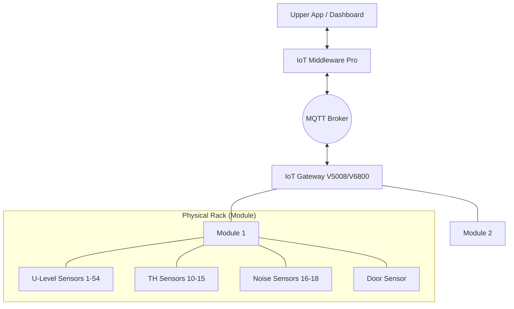

# IoT Middleware Pro - Product Requirements Document (PRD) v1.2

**File Name:** `PRD.md`

**Scope:** Product Requirements
**Date:** 1/23/2026
**Status:** Approved for Development

## 1. Executive Summary

IoT Middleware Pro is a high-throughput integration layer designed to unify data from heterogeneous IoT Gateways (V5008/Binary and V6800/JSON) into a standardized format. It serves as the central nervous system for the **U-Level IoT System**, providing real-time dashboards, historical storage, and external system integration.

### 1.1 Domain Concepts & Components

- **U‑Level IoT System:** A Data Center Asset Management system focused on real-time tracking of IT assets (Rack U-position), environmental monitoring (Temp/Hum/Noise), and security (Door status).
- **IoT Gateway:** The edge device that aggregates sensor data via RS485/Modbus and communicates with the Middleware via MQTT.
    - **V5008:** Binary protocol device, supports max 5 Modules.
    - **V6800:** JSON protocol device, supports max 24 Modules.
- **Module:** A physical sensor strip installed in a server rack. It acts as the container for sensors. Identified by `moduleIndex` (Address) and `moduleId` (Serial).
- **U‑Level Sensor:** Detects asset presence (RFID tags) at a specific Rack Unit. Range: `uIndex` 1–54.
- **TH Sensor:** Monitors Temperature & Humidity. Range: `thIndex` 10–15 (Max 6/module).
- **NS Sensor:** Monitors Noise Levels (dB). Range: `nsIndex` 16–18 (Max 3/module).
- **Door Sensor:** Detects if the rack door is Open or Closed. (1 or 2 per module).
- **IoT Middleware:** The backend engine that normalizes heterogeneous device data into a standard format and exposes it via API/WebSocket.

### 1.2 System Hierarchy

---

## 2. Functional Requirements

### 2.1 Ingestion & Parsing

- **FR-01:** System MUST accept MQTT connections on `V5008Upload/+/#` and `V6800Upload/+/#`.
- **FR-02:** System MUST detect device type (V5008 vs V6800) based on topic structure or header bytes.
- **FR-03:** System MUST parse V5008 Binary payloads (Big-Endian, signed integers, hex strings).
- **FR-04:** System MUST parse V6800 JSON payloads and normalize field names.
- **FR-05:** System MUST handle "Cold Start" scenarios for V6800 (requesting a full snapshot if an event arrives without cached state).

### 2.2 Normalization & State Management

- **FR-06:** System MUST maintain a "Device Shadow" (Cache) representing the latest state of every module.
- **FR-07:** System MUST perform **Diffing** for Snapshots (Comparing Input vs Cache to generate Events).
- **FR-08:** System MUST implement a **"Sync Trigger"** mechanism for V6800 RFID Events (Triggering a query to fetch truth, rather than guessing state).
- **FR-09:** System MUST normalize all sensor indices to a generic `sensorIndex`.
- **FR-10:** System MUST detect and log **Configuration Changes** (Audit Log). If Device IP, Firmware, or Module configuration changes, a human-readable event must be recorded.

### 2.3 Storage (Persistence)

- **FR-11:** System MUST batch database writes to minimize IOPS (Default: 100 items or 1000ms).
- **FR-12:** System MUST pivot array-based telemetry (Temp/Hum/Noise) into column-based SQL records (`temp_index10`, etc.).
- **FR-13:** System MUST store `DEVICE_METADATA` using Upsert logic (keep latest only).

### 2.4 Data Output (Fan-Out)

- **FR-14:** System MUST support parallel output channels (Storage, API, WebSocket, Webhook, MQTT Relay).
- **FR-15:** Failure in one output channel MUST NOT block others.

---

## 3. Interface Requirements

### 3.1 REST API (Consumer Interface)

The API reads directly from the **State Cache** for low-latency (<10ms) responses.

| Method | Endpoint | Description |
| --- | --- | --- |
| `GET` | `/api/health` | System status (DB connection, MQTT status). |
| `GET` | `/api/devices` | **List all devices** containing metadata and active modules list (For Dashboard Sidebar). |
| `GET` | `/api/devices/{id}/modules/{index}/state` | Full sensor state (Temp, RFID, Door) for a specific rack (For Dashboard Detail View). |

### 3.2 WebSocket (Real-Time Stream)

- **Endpoint:** `/ws`
- **Behavior:** Broadcasts the `SUO` (Standard Unified Object) JSON immediately after normalization.
- **Client Filter:** Clients can subscribe to specific `deviceId` (implementation detail).

### 3.3 Webhook (Integration)

- **Trigger:** On specific message types (Configurable, defaults: `RFID_EVENT`, `DOOR_STATE`).
- **Payload:** POST the `SUO` JSON to external URL.
- **Retry:** Exponential backoff (3 attempts).

### 3.4 MQTT Relay (M2M)

- **Topic:** `Normalized/{deviceType}/{deviceId}/{messageType}`
- **Payload:** `SUO` JSON.

---

## 4. Non-Functional Requirements

- **Performance:** < 50ms latency from Ingestion to WebSocket broadcast.
- **Reliability:** Auto-reconnection for DB and MQTT.
- **Scalability:** Stateless architecture (except for Cache) to allow horizontal scaling.
- **Maintainability:** Strict separation of Parser, Normalizer, and Output logic.

---

- - END OF FILE [PRD.md](http://prd.md/) ---